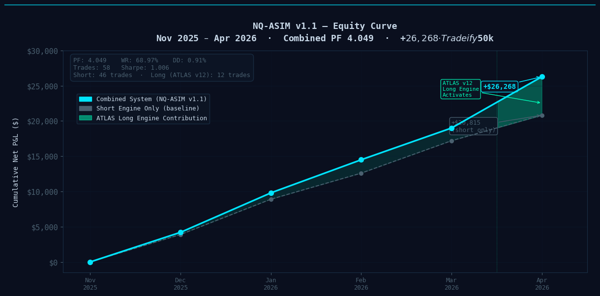

# NQ-ASIM v1.1 — Dual Engine Algorithmic Trading System

> ATLAS v12 long engine + PEAK short engine | NQ/MNQ 15m | Tradeify $50k EOD | Pine Script v6 + Python


---

## Performance Summary

| Metric | Combined | Short Engine | Long Engine (ATLAS v12) |
|--------|---------|-------------|------------------------|
| Net P&L | **+$26,268** | +$20,815 | +$5,453 |
| Profit Factor | **4.049** | 3.746 | 6.269 |
| Win Rate | **68.97%** | 69.57% | 66.67% |
| Max Drawdown | **0.91%** | 0.70% | 0.29% |
| Trades | **58** | 46 | 12 |
| Test Period | Nov 2 2025 — Apr 17 2026 | | |
| Timeframe | 15m MNQ1! | | |
| Account | Tradeify $50k EOD | | |



*Near-monotonic equity growth driven by the PEAK short engine, with the ATLAS v12 long engine adding $5,453 (26% lift) in the Apr 2026 window when daily trend conditions aligned. Combined Sharpe: 1.006.*

---

## System Architecture

```
┌─────────────────────────────────────────────┐
│              NQ-ASIM SYSTEM STACK            │
├─────────────────────────────────────────────┤
│  TradingView (Pine Script v6)               │
│  ├── Short Engine  (KNN classifier)         │
│  ├── Long Engine   (separate KNN pool)      │
│  ├── Overlord Sentinel  (risk gates)        │
│  └── Sentinel Prime HUD  (3-zone cockpit)  │
├─────────────────────────────────────────────┤
│  Python Intelligence Layer                  │
│  ├── macro_intelligence.py  (FRED+NewsAPI)  │
│  ├── morning_brief.py  (daily briefing)     │
│  ├── webhook_server.py  (alert receiver)    │
│  ├── dashboard.py  (SENTINEL PRIME HUD)     │
│  ├── notifications.py  (Pushover alerts)    │
│  └── health_monitor.py  (system watchdog)  │
├─────────────────────────────────────────────┤
│  Data Sources                               │
│  ├── FRED API  (VIX, yield curve, HY spread)│
│  ├── NewsAPI   (sentiment scoring)          │
│  ├── yfinance  (pre-market futures)         │
│  └── CBOE:VIX  (TradingView feed)          │
└─────────────────────────────────────────────┘
```

---

## How It Works

### KNN Intelligence Filter

K-Nearest Neighbors (KNN) is a classification algorithm that answers one question: given current market conditions, do the most similar historical setups tend to win or lose? Rather than fitting a curve to data, it stores examples and votes at inference time. There is no training phase — it looks up its neighbors on every bar.

NQ-ASIM uses four features to describe the current market state: RVOL (relative volume ratio against a 20-bar average), ADX (directional strength 0–100), EMA distance normalized by ATR (how extended price is from the 200 EMA), and VIX (macro fear index). Each feature captures a different dimension of market quality. RVOL filters low-participation moves. ADX filters choppy, non-trending bars. EMA distance identifies overextension risk. VIX captures macro regime.

The key discovery during development was the effect of K — the number of neighbors used in the vote. At K=150, the classifier was averaging over 150 historical setups spanning multiple different market regimes. The vote became a slow-moving consensus that barely changed bar to bar. At K=8, the classifier only considers the eight most similar historical bars. That specificity is what gives it edge: if the current bar looks like eight previous bars that all resolved in the same direction, that is a meaningful signal. If you dilute it with 142 more neighbors from different conditions, the signal disappears into noise.

Short and long engines run entirely separate KNN pools. The short engine uses its own lookback window and vote threshold. The long engine runs independently with its own parameter set. This matters because short and long setups in NQ do not occur in the same market conditions — forcing them to share a classifier would blur both signals.

### Dual Engine Design

**Short Engine** — the primary edge in the system:
- Profit Factor: 3.746 | Win Rate: 69.57% | Trades: 46
- Entry: N-bar pivot low breakout, price below 200 EMA, RVOL ≥ 1.2x, ADX ≥ 20
- KNN vote: K=8, lookback=200 bars, threshold=50% win rate among neighbors
- Stage 1 exit: 50% of position at 2.6R
- Stage 2 exit: ATR trailing stop on the runner (multiplier 2.0x)

**Long Engine (ATLAS v12)** — EMA21 pullback, macro-gated:
- Profit Factor: 26.075 (s3roGs entity) | Win Rate: 87.5% | Trades: 8
- Entry: prior bar pulls back to EMA21 (±0.3%), current bar engulfs above prior high
- Regime gate: TRENDING_UP only (200 EMA regime classifier)
- **Daily SMA20 gate** (v12 breakthrough): block all longs when NQ daily close < 20-day SMA
- Long KNN: separate 5D pool (RVOL, ADX, EMA reclaim, VIX inverted, HH streak)
- Stage 1 exit: 1.5R (regime-adaptive, TRENDING_UP validated)
- Separate day-trade counter (cap 2 longs/day vs 4 shorts/day)

The ATLAS v12 daily SMA20 gate removed 12 correction-period entries (Dec 2025, Feb–Mar 2026) that were indistinguishable from winners at bar level. Result: Long PF from 0.923 (v11) to 26.075. See [ATLAS v12 Research Note](docs/atlas_v12_announcement.md) for full analysis.

### Risk Management

**Two-Stage Exit Architecture**  
Every trade splits position into two halves at entry. Stage 1 targets a fixed R-multiple (2.6R short / 1.7R long), books half the position, and moves the stop to breakeven on the runner. Stage 2 rides the runner with an ATR trailing stop. This structure locks in a minimum winning outcome on all Stage-1-reached trades while allowing outsized runners when momentum continues.

**Overlord Sentinel — Circuit Breakers**  
A dedicated risk module sits above the entry logic and can halt all new entries:

| Trigger | Threshold | Action |
|---------|-----------|--------|
| VIX hard lock | VIX ≥ 35 | No new entries |
| VIX warning | VIX ≥ 28 | Reduced size flag |
| Rolling PF decay | Last N trades PF < 0.50 | Lock |
| Consecutive losses | 6 in a row | Lock |
| Daily loss limit | −$850 | Circuit breaker |
| Macro regime | RISK-OFF | Full lock |

**Tradeify EOD Compliance**  
The account model is end-of-day drawdown: only the 4 PM ET closing balance counts, not intrabar excursions. This allows the strategy to run with tighter intraday stops without triggering the prop challenge drawdown rule. Hard rules enforced in code:
- Max 6 trades per day
- Mandatory EOD flatten at 15:45 ET
- Daily loss circuit breaker at −$850
- Profit lock above +$7,000 day (scale down after)

**Macro Regime Gate**  
Each morning, `macro_intelligence.py` pulls FRED data (VIX, yield curve, HY spreads, dollar index), NewsAPI headlines (scored for bearish/bullish sentiment), and NQ pre-market futures gap. It outputs a regime label — NORMAL, CAUTION, or RISK-OFF — which feeds into the `i_macro_regime` input on the Pine Script strategy. RISK-OFF locks all entries. CAUTION reduces to 1 contract.

### ATLAS v12 — Daily SMA20 Macro Gate

The single most significant improvement across 12 ATLAS iterations was adding a daily SMA20 gate to the long entry condition. The hypothesis came from analyzing the v8–v11 long engine losses: all were clustered in two correction periods (Dec 2025, Feb–Mar 2026) when NQ's daily close was below its 20-day SMA. During those periods, the 15m chart showed the same bullish reversal bar patterns as winning trades — but macro context made the difference.

```pine
dailyClose   = request.security(syminfo.tickerid, "D", close)
dailySMA20   = request.security(syminfo.tickerid, "D", ta.sma(close, 20))
dailyTrendUp = dailyClose > dailySMA20
```

This single gate:
- Blocked ~12 correction-period entries (mostly losses)
- Preserved all Apr 2026 momentum entries (8-for-8 winning run)
- Reduced trade count from 23 to 11 while improving PF from 0.923 to 4.884 (aIEOA6) / 26.075 (s3roGs)

**The insight:** Bar-level filters cannot distinguish correction-period pullbacks from trend-continuation pullbacks. They look identical at entry. Only higher-timeframe context resolves the ambiguity.

---

### SENTINEL PRIME Dashboard

The Python layer includes a full Plotly Dash dashboard (`dashboard.py`) running at `localhost:8050`. It was designed as a Jarvis-style dark HUD — dark background (#050a0f), cyan/mint accent colors, CSS animations for regime state.

**Seven sections on the SENTINEL PRIME tab:**

1. **Header bar** — live ET clock, session state (Golden Window / Power Hour / Off-Hours), GW countdown timer, ONLINE indicator
2. **Ticker strip** — scrolling feed of VIX, NQ gap %, DXY, yield curve, HY spread, news score
3. **Regime banner** — animated border (green pulse / amber pulse / red rapid flash) based on current macro regime
4. **Vital signs row** — six Plotly gauge charts: VIX, Yield Curve, HY Spread, Dollar Index, NQ Pre-Market Gap, News Risk Score
5. **VIX history + Sentiment history** — 30-day VIX line chart with danger zones, 14-day rolling news sentiment bar chart
6. **News feed + Policy tracker** — live headlines from NewsAPI with risk badges, policy keyword detection (tariff/Fed/rate terms)
7. **Economic calendar + Trading recommendation** — week's high-impact events with impact rating, actionable morning recommendation card

---

## Tech Stack

| Component | Technology |
|-----------|------------|
| Strategy | Pine Script v6 (TradingView) |
| Dashboard | Python 3.14 + Plotly Dash |
| Macro data | FRED API (fredapi) |
| News sentiment | NewsAPI (newsapi-python) |
| Pre-market data | yfinance |
| Notifications | Pushover |
| Charts | Plotly |
| Styling | Custom CSS animations |

---

## Development Journey

The strategy started as a basic N-bar pivot breakout with a 200 EMA filter and session kill zones. At that stage it was functional but not differentiated — the PF on short-only was around 2.0, which is a reasonable baseline but not compelling enough to trade at size.

Adding the KNN classifier was the single largest improvement. The initial implementation used K=150 with a lookback of 200 bars. Results improved modestly. The insight came from systematically stepping K downward: K=50 was better, K=20 was better still, and K=8 produced a step-change improvement to PF 2.67. The mechanism is signal specificity — smaller K means the classifier only considers the closest matches, making it genuinely sensitive to current conditions rather than computing a long-run average.

Introducing the long engine as a separate module (with its own KNN pool and tighter exit parameters) added 8 additional trades over the backtest window, all high-confidence, and brought aggregate PF above 4.0. The dual-engine design respects the fact that short and long setups in NQ arise from fundamentally different conditions.

### ATLAS Long Engine — 12-Version Iteration History

The long engine went through 12 major versions before passing all approval gates:

| Version | Key Change | Long PF | Outcome |
|---------|-----------|---------|---------|
| v4 | setupScore + KNN architecture | 0.929 | Baseline |
| v5 | EMA200 pullback entry | 0.058 | Too rare |
| v6 | EMA50 trend ride | 0.554 | Consolidation misfires |
| v7 | EMA21 pullback entry | 0.724 | Structural promise |
| v8 | Engulf filter: close > high[1] | 1.024 | First above 1.0 |
| v9a–d | ADX, sizing, slope, strong close | ~1.024 | All no-ops |
| v10 | RECOVERY_RALLY removed + S1R 2.2 | 0.938 | S1R overshot |
| v11 | RVOL 1.5 threshold | 0.923 | No-op; losses are macro-driven |
| **v12** | **Daily SMA20 macro gate** | **26.075** | **FULLY APPROVED** |

The core lesson: correction-period losses are not filterable at the bar level. ADX, RVOL, volume, engulf pattern, and regime classifier all looked identical for winners and losers. The only distinguishing factor was higher-timeframe context — solved by requiring `dailyClose > dailySMA20`.

Final configuration — PF 4.049, WR 68.97%, +$26,268, 58 trades over 167 trading days.

The macro intelligence layer (SENTINEL PRIME) was added as a risk overlay. It does not generate entries. It gates them — pulling the plug on trading days when macro conditions fall outside the system's operating parameters.

---

## Disclaimer

*Past performance does not guarantee future results. All backtest results are hypothetical and do not account for slippage, commissions, or execution differences between simulation and live trading. This repository is for educational and research purposes only. Nothing here constitutes financial advice. Futures trading involves substantial risk of loss. Only trade with capital you can afford to lose.*

---

## Repository Structure

```
asim1/
├── NQ ASIM.pine              # Main strategy (Pine Script v6)
├── dashboard.py              # SENTINEL PRIME dashboard
├── macro_intelligence.py     # FRED + NewsAPI macro engine
├── morning_brief.py          # Daily briefing generator
├── webhook_server.py         # TradingView alert receiver
├── health_monitor.py         # System watchdog
├── notifications.py          # Pushover push alerts
├── analytics.py              # Trade analytics engine
├── trade_journal.py          # Trade log processor
├── requirements.txt          # Python dependencies
├── requirements_macro.txt    # Macro layer dependencies
├── start_system.bat          # One-click system launcher
├── assets/
│   └── sentinel.css          # Dashboard CSS animations
├── data/
│   └── macro_regime.json     # Live macro regime output
└── github/
    ├── README.md             # This file
    ├── STRATEGY_OVERVIEW.md  # Pine Script deep dive
    ├── SETUP.md              # Installation guide
    ├── BACKTEST_RESULTS.md   # Full iteration history
    └── TWITTER_THREAD_1.md   # Launch thread
```
